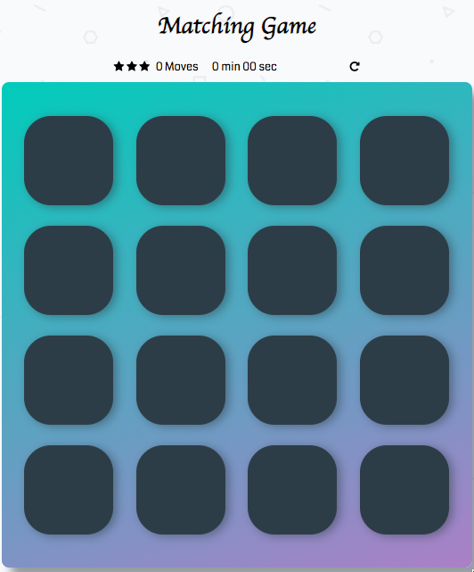

# Memory Game Project

## Table of Contents

* [Instructions](#instructions)
* [Scoring](#scoring)

## Instructions

The game will start when the first card is clicked.  Click the cards to reveal symbols underneath.  Only two cards can be revealed at a time.  Matching all 8 pairs ends the game.

## Scoring

1) Fifteen moves and less earn all 3 stars
2) Between 16 and 24 moves earns 2 stars
3) Greater than 24 moves earns 1 star
